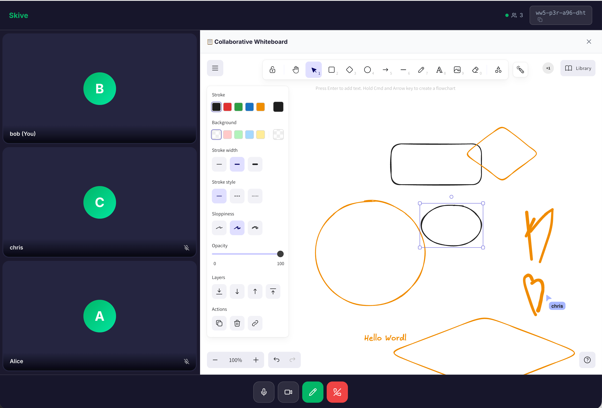

# Skive — Real-Time Video Meetings

[](https://deploy.workers.cloudflare.com/?url=https://github.com/casperm/skive-meeting)

Skive is a lightweight, edge-native video meeting application built for speed and simplicity. It leverages the power of Cloudflare's global network to provide low-latency video, real-time signaling, and a collaborative whiteboard experience.

**Created by Google Antigravity**

---

## Features

- ⚡ **Edge-Native**: Built with Next.js and deployed on Cloudflare Pages + Workers.
- 📡 **Real-Time Signaling**: Powered by Durable Objects for instantaneous state syncing.
- 🎥 **SFU Media**: Uses Cloudflare Calls for high-performance WebRTC media transport.
- 🎨 **Whiteboard**: Collaborative Excalidraw integration for shared brainstorms.
- 🧼 **Auto-Cleanup**: Automatic session data termination when the last user leaves.

---

## Screenshots


*Landing page with "Start Meeting" and "Join Meeting" options.*


*Active meeting room with participant grid and collaborative whiteboard.*


---

## Cost Estimation (Cloudflare Calls)

Skive uses **Cloudflare Calls** for its SFU (Selective Forwarding Unit) capabilities.

- **Pricing**: $0.05 per real-time GB (egress).
- **Free Tier**: The first 1 TB (1,000 GB) per month is **free**.

### Scenario: 10 Users for a 2-Hour Meeting

**Assumptions**:
- **10 Participants**: Each sending 1 video/audio stream and receiving 9 remote streams.
- **Bitrate**: ~1 Mbps per received stream (standard HD video + audio).
- **Duration**: 2 hours (120 minutes).

**Calculation**:
1.  **Bandwidth per user**: 9 incoming streams * 1 Mbps = 9 Mbps.
2.  **Total Bandwidth**: 10 users * 9 Mbps = 90 Mbps.
3.  **Total Data Transfer**: 90 Mbps * 7200 seconds / 8 bits/byte = **81,000 MB** (~79.1 GB).

**Estimated Cost**:
- **Data**: ~79.1 GB.
- **Cost**: $0.00 (Covered by the massive 1 TB free tier).
- **Overages**: If you exceed the free tier, this meeting would cost approx. **$3.96**.

---

## Quick Startup Guide

### 1. Setup Cloudflare Realtime (SFU)
To enable video and audio transport, you need to create a Cloudflare Calls application:

1. Log in to your [Cloudflare Dashboard](https://dash.cloudflare.com/).
2. Navigate to **Realtime** -> **Calls**.
3. Create a new **App**.
4. Capture the **App ID** and **App Secret**.

### 2. Configure Secrets
Set your Cloudflare credentials as encrypted secrets:

```bash
# Production secrets
npx wrangler secret put CALLS_APP_ID
npx wrangler secret put CALLS_APP_SECRET

# Local development (optional)
# Create a .dev.vars file in the root directory:
# CALLS_APP_ID=your_id
# CALLS_APP_SECRET=your_secret
```

### 3. Build & Deploy
Deploy the application to Cloudflare with a single command:

```bash
# Build the Next.js static export and deploy to Cloudflare
npm run deploy
```

> **Note**: If this is your first time deploying a project with Durable Objects, Wrangler will automatically create the required migration and binding in your Cloudflare account.


---

## Local Development

To run the application locally with full Durable Object and SFU support:

```bash
# This builds Next.js and starts Wrangler (Miniflare)
npm run dev:worker
```

Open `http://localhost:8787` in your browser.

---

## The Refined Prompt
This application was engineered using the following prompt:

> "Build a real-time video meeting application called Skive using Next.js (with static export) and Cloudflare Workers. Use Cloudflare Durable Objects for WebSocket signaling and session state management. Integrate Cloudflare Calls SFU for low-latency WebRTC media transport. Include a collaborative Excalidraw whiteboard that synchronizes drawing data across participants via the same Durable Object. The UI should have a clean, modern aesthetic inspired by Grain, using a green brand palette (#00B667) and glassmorphism for the meeting room. Implement automatic cleanup of meeting data using Durable Object alarms when all participants disconnect. Meeting IDs should be generated in the format 'xxx-yyy-zzz-www' and be case-insensitive."

---

*Powered by Google Antigravity*
